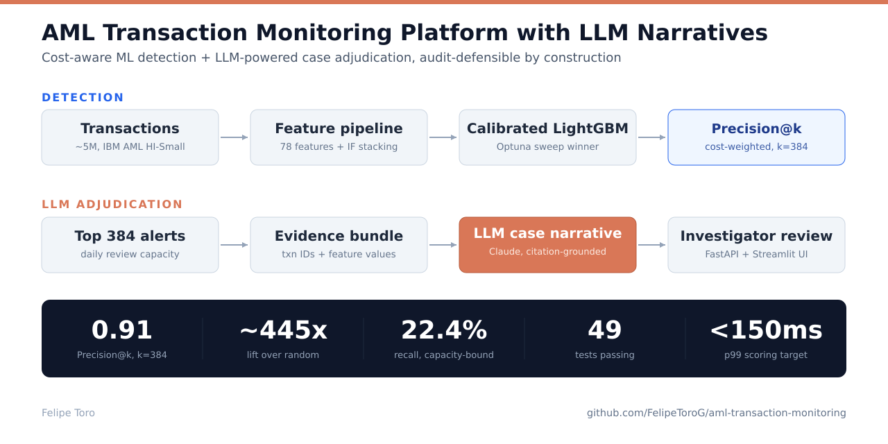
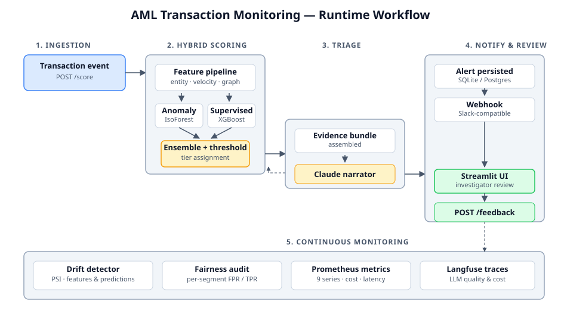
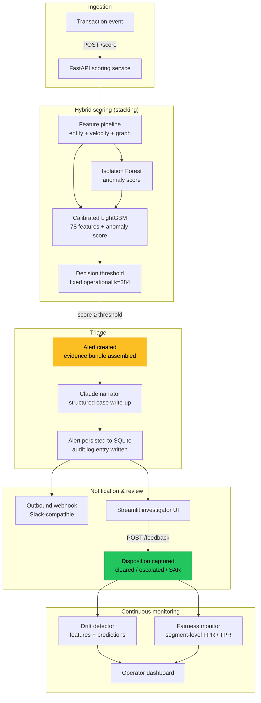

# AML Transaction Monitoring & Alert Triage System with LLM Narratives



End-to-end production AML monitoring service for payment platforms. Hybrid anomaly detection plus supervised classification on a 5M-transaction labeled corpus, cost-sensitive threshold optimization, Claude-powered case narrative generation, an investigator-feedback loop, and live drift and fairness monitoring, packaged as a containerized FastAPI service with a Streamlit investigator review UI.

**Author:** Felipe Toro
**License:** MIT
**Status:** v1 - trained end-to-end on the full 5M-transaction dataset via the canonical `src.models.train` pipeline on a CUDA workstation. v1 replaces the v0 weighted-blend ensemble with Isolation-Forest-score stacking, tunes the decision threshold at the fixed operational k, and recalibrates the false-negative cost to regulatory exposure. The v0 issues that motivated these changes are diagnosed in [docs/INCIDENT_REPORT.md](docs/INCIDENT_REPORT.md).

---

## TL;DR

A real-time AML transaction monitoring service designed for payments and money-transmitter platforms (Stripe Radar / Wise / Mercury-class teams). Every alert carries a structured, evidence-bound case narrative ready for compliance officer review: no hallucinated facts, every claim traces to a specific transaction or feature value.

| What | Value |
|------|-------|
| Dataset | IBM AML HI-Small (~5M transactions, labeled illicit / licit) |
| Model architecture | Isolation Forest anomaly score stacked as a feature into a calibrated LightGBM classifier |
| Models evaluated | 2 supervised families swept (XGBoost, LightGBM); Random Forest and Logistic Regression dropped as cost-prohibitive at 5M rows - see [INCIDENT_REPORT.md](docs/INCIDENT_REPORT.md) |
| Optimization objective | Investigator-hour-cost-weighted Precision@k |
| Case narrative generation | Claude (Sonnet for production, Haiku for offline evals) |
| Alert audit trail | Every alert: feature vector, model version, threshold, narrative, investigator disposition |
| Inference SLO | Designed for sub-150 ms p99 on the scoring path |
| Observability | Langfuse for LLM call tracing; Prometheus metrics for inference latency and alert volume |
| Drift monitoring | Population Stability Index on top-k features and prediction distribution |
| Fairness | Demographic parity, equal opportunity, FPR parity across customer segments |



---

## Why this project

Banks and fintech compliance teams spend billions annually on AML monitoring and still drown in false positives. Industry-reported AML alert false-positive rates exceed ninety-five percent at most institutions, meaning investigators spend the overwhelming majority of their day clearing benign activity. Reducing that rate, without sacrificing true-positive recall, is the single highest-leverage problem in AML operations.

This system is built around what production AML monitoring actually requires, not what a notebook demonstrates:

1. **Audit-defensible methodology.** Every alert produces a structured audit trail: feature values, model version, threshold, and the evidence supporting each narrative claim. Compliance officers and regulators can reconstruct any decision.
2. **Cost-aware objective.** Models are selected on investigator-hour-cost-weighted Precision@k, not AUC-PR. The right model is the one that minimizes total cost (investigator time spent on false positives plus illicit dollars missed), not the one that scores highest on the academically conventional metric.
3. **Evidence-bound case narratives.** The LLM never invents transactions or features. Every claim in a case narrative cites either a transaction ID or a feature value from the evidence bundle. Refusal-on-low-confidence is built into the prompting layer; hallucination is mathematically constrained, not just discouraged.
4. **Investigator feedback loop.** Every disposition (cleared / escalated / SAR-filed) flows back into the system. Suppression-rate and false-positive-rate metrics update in real time. The model improves with use rather than rotting in production.
5. **Fairness and drift as first-class concerns.** Bias audits run on every model release. Population Stability Index monitors feature and prediction drift. Alerts fire when either crosses regulator-relevant tolerance.

I'm a former defense aerospace finance professional transitioning into AI/ML engineering. The domain insight I bring is real: I have defended $300M+ in proposals against federal auditors and built quantitative cost models for high-stakes regulatory environments. Audit-defensibility is not a feature I added; it is the way I think.

---

## Architecture



The scoring path is synchronous and designed for sub-150 ms p99 latency on the score-only request. The triage path (LLM call) runs in the same request handler when the alert tier requires immediate human review, or via background task for lower-tier alerts. The investigator UI and the alert persistence layer share a single SQLite database (production-pluggable to Postgres without code changes); the webhook layer is fire-and-forget over httpx with bounded retry.

---

## Repository structure

```
aml-transaction-monitoring/
├── configs/
│   ├── api_config.yaml          # Runtime config: model path, thresholds, webhook, LLM
│   ├── model_config.yaml        # Optuna search spaces per model family
│   ├── cost_matrix.yaml         # Cost-sensitive eval weights
│   └── alert_thresholds.yaml    # Tiered alert thresholds
├── data/
│   ├── raw/                     # IBM AML CSV (gitignored, see Setup)
│   ├── processed/
│   └── external/
├── docs/
│   ├── ARCHITECTURE.md          # System design deep dive
│   ├── EVALUATION.md            # Eval methodology & metric definitions
│   ├── DEPLOYMENT.md            # Local & cloud deployment guide
│   ├── REGULATORY_NOTES.md      # Mapping to bank model-risk requirements
│   └── images/                  # Workflow diagram, UI screenshots
├── models/
│   └── ensemble.pkl             # Serialized production scoring pipeline
├── notebooks/
│   ├── 01_eda.ipynb
│   ├── 02_feature_engineering.ipynb
│   ├── 03_modeling.ipynb
│   ├── 04_drift_analysis.ipynb
│   └── 05_bias_fairness_audit.ipynb
├── scripts/
│   ├── download_data.sh         # Fetch IBM AML HI-Small
│   ├── train.sh                 # Full training pipeline driver
│   ├── smoke_test_api.sh        # End-to-end API contract check
│   ├── load_test.sh             # Latency / throughput sweep
│   └── update_results.py        # Refreshes README results table after training
├── src/
│   ├── data/                    # Schema & dataset loading (single source of truth)
│   ├── features/                # Entity, velocity, graph features + sklearn Pipeline
│   ├── models/                  # Anomaly, classifier, ensemble, training driver
│   ├── evaluation/              # Precision@k, investigator simulator, calibration
│   ├── monitoring/              # Drift detection, fairness audit
│   ├── triage/                  # Claude narrator, prompts, output schemas
│   ├── persistence/             # SQLite layer (Alert, Feedback, AuditLog)
│   ├── api/                     # FastAPI service (routes, schemas, webhook)
│   ├── observability/           # Langfuse tracing + Prometheus metrics
│   └── utils/                   # Config loader, structured logger
├── ui/
│   ├── app.py                   # Streamlit investigator dashboard
│   ├── pages/                   # Alert queue, alert detail, drift, fairness
│   └── components/              # Reusable UI components
├── tests/                       # Unit & contract tests (pytest)
├── Dockerfile                   # API image (multi-stage, non-root)
├── Dockerfile.ui                # Streamlit image
├── docker-compose.yml           # Local stack: api + ui + sqlite volume
├── pyproject.toml
├── requirements.txt             # Training-time dependencies (pinned)
├── requirements-api.txt         # API runtime dependencies (pinned)
└── requirements-ui.txt          # Streamlit dependencies (pinned)
```

---

## Setup

### Prerequisites

- Python 3.11+
- Docker and docker-compose (optional, for the containerized stack)
- An Anthropic API key (the case narrative layer calls Claude)
- The IBM AML HI-Small dataset (see "Reproduce" below)

### Install

```bash
git clone https://github.com/FelipeToroG/aml-transaction-monitoring.git
cd aml-transaction-monitoring

python3.11 -m venv venv
source venv/bin/activate

pip install -r requirements.txt
pip install -r requirements-api.txt
pip install -r requirements-ui.txt

# Editable install so `src.*` imports resolve in tests, notebooks, and ad-hoc scripts.
pip install -e .

cp .env.example .env
# Edit .env: add ANTHROPIC_API_KEY and optional Langfuse keys.
```

### Reproduce the model

```bash
# 1. Download IBM AML HI-Small (~5M transactions).
bash scripts/download_data.sh

# 2. Walk through EDA.
jupyter notebook notebooks/01_eda.ipynb

# 3. Run the training pipeline (Optuna sweep + stacking refit; ~2-3 hours end-to-end on a CUDA workstation, dominated by the train+val refit; the feature cache makes re-runs much faster).
bash scripts/train.sh
```

Training writes the serialized ensemble to `models/ensemble.pkl` and logs every Optuna trial to `mlruns/`. The driver also calls `scripts/update_results.py`, which refreshes the results table in this README from the training output.

### Run the stack locally (Docker)

```bash
docker-compose up --build
```

This starts the FastAPI service on port 8000 and the Streamlit investigator UI on port 8501. Open http://localhost:8501 for the dashboard or http://localhost:8000/docs for the Swagger API.

### Run components individually

```bash
# FastAPI service
uvicorn src.api.main:app --reload --port 8000

# Streamlit investigator UI (in a second terminal)
streamlit run ui/app.py
```

### Run the tests

```bash
pytest tests/ -v
```

The suite covers the data loader's schema contract, the feature pipeline's structure and zero-leakage guarantees, the model artifact roundtrip, the full API contract (request validation, response shape, threshold behavior), webhook dispatch logic, narrator output schema, persistence layer CRUD, drift detection edge cases, and fairness audit correctness.

---

## API contract

The service exposes six endpoints. Schemas live in `src/api/schemas.py` and auto-generate the OpenAPI documentation at `/docs`.

### `GET /health`

Liveness and readiness probe. Returns model load state, version, configured thresholds, and downstream-service health (LLM provider, database).

### `GET /metrics`

Prometheus metrics endpoint. Exposes inference latency histograms, alert volume counters by tier, feedback distribution, and LLM call cost / latency.

### `POST /score`

Score a single transaction. Returns the calibrated risk score (the supervised probability over the feature matrix, which already includes the stacked Isolation Forest anomaly score as a column), tier classification, model version, and the feature attribution that drove the score.

### `POST /triage`

Generate a structured case narrative for an existing alert. Returns the narrative with cited evidence, narrator model and version, and confidence indicators.

### `POST /feedback`

Capture investigator disposition for an alert. Updates the alert log and feeds the suppression-rate and FPR metrics.

### `GET /alerts`

Paginated alert queue with filters by tier, status, and date range. Powers the Streamlit investigator UI.

Full request and response schemas auto-generate at `/docs` (Swagger) and `/redoc`.

---

## Engineering decisions worth noting

A handful of choices in this repo are deliberate enough that they would survive senior code review.

**Hybrid scoring with stacking.** Pure supervised models miss novel laundering typologies absent from the training labels; pure unsupervised models drown investigators in cluster noise. The system fits an Isolation Forest (novelty / pattern-rarity) and appends its calibrated anomaly score as a feature column the gradient-boosted classifier consumes alongside the 78 engineered features. Rather than blending the two with hardcoded weights, the supervised model learns the optimal non-linear weighting of the anomaly signal directly. On held-out data the stacked anomaly score ranks among the model's most important features.

**Cost-weighted Precision@k, not AUC-PR.** Investigators have finite review capacity. A model that scores 0.92 AUC-PR but produces four times the alert volume of the production baseline is not deployable. The training objective is investigator-hour-cost-weighted Precision@k, where `k` is calibrated to the team's actual review throughput. This is what model selection looks like when investigator time is the binding constraint.

**Evidence-bound case narratives.** The Claude triage layer never invents facts. The prompt assembles a structured evidence bundle (the transaction, the entity's recent activity, the features that fired) and instructs the model to produce a Pydantic-validated case narrative where every claim cites either a transaction ID or a feature value. Outputs that fail validation are rejected and re-requested with stricter framing. Hallucination is mathematically constrained, not just discouraged.

**Schema lives in one file.** `src/data/loader.py` is the single source of truth for column names, dtypes, and the target column. The API's Pydantic request schema, the feature pipeline's `ColumnTransformer`, the database models, and every test in the suite import from the same constants. A rename in `loader.py` either propagates cleanly or fails loudly at import time.

**Zero-leakage by construction.** All preprocessing (scaling, encoding, target-aware aggregations) lives inside the sklearn Pipeline. The pipeline is fit only on the temporal training split. Validation and test folds never see the fitted transformers before prediction time. Leakage is impossible by construction, not by discipline.

**Asymmetric audit logging.** Every alert is logged with full feature provenance. Cleared alerts retain narrative and features for retraining; escalated alerts additionally log the investigator's free-text justification (when provided) for SAR-narrative training data. The audit log is append-only and indexed for regulator query.

**Webhook dispatch is fire-and-forget with bounded retry.** Outbound notifications must not block the scoring path. The webhook layer uses httpx async with an exponential-backoff retry envelope; delivery failures degrade silently to the operator dashboard rather than failing the scoring request.

**API rejects unknown fields.** `extra="forbid"` on all request schemas. Silent acceptance of unknown inputs is the most common path to client-server contract drift; the API surfaces it as HTTP 422 instead.

---

## Key findings

The results below are from the v1 training run (the canonical src.models.train pipeline) on the full 5M-transaction IBM AML HI-Small dataset. Methodology and metric definitions live in [docs/EVALUATION.md](docs/EVALUATION.md); the per-trial audit trail is preserved in MLflow under the `aml-transaction-monitoring` experiment.

**How to read these numbers.** The headline metric is Precision@k at the operational alert capacity of k = 384 alerts per day (8 analysts times 48 alerts each). At that operating point the v1 model is ~445x more precise than random alerting - 91% of the top-384 alerts are real laundering, against a ~0.2% base rate. Recall at k=384 is 22.4%, and that ceiling is structural, not a model weakness: the test window holds 1,561 true laundering cases but the team can review only 384, so even a perfect ranker tops out at 384 / 1,561 = 24.6% recall. The model fills 350 of its 384 daily alerts with real cases. Raising recall is a function of review headcount, not model quality.

One caveat so a number is not over-read: test Precision@k (0.91) exceeds validation (0.80) because the held-out test window carries roughly twice the fraud prevalence of validation - the dataset's illicit rate rises over time and the temporal split places the densest period in test, and Precision@k mechanically rises with base rate. Normalized for prevalence (lift = Precision@k / base rate), validation actually edges test (~800x vs ~445x), confirming the higher test precision is a denser positive population, not a stronger model.

A concrete walk-through: of 761,752 test transactions, 1,561 are laundering. The model scores all of them and surfaces the top 384 (the team's daily capacity); ~350 are real and ~34 are false alarms (the 91% precision). The other ~761,368 are never reviewed.

<!-- RESULTS:START -->

### Headline results (test fold)

| What | Value |
|---|---|
| Winning model | LightGBM (selected on cost-weighted Precision@k) |
| Test set objective | $216,225.90 cost per investigator-hour (negated) |
| Test Precision @ k | 91.1% (k = 384 alerts) |
| Test recall (fraud caught) | 22.4% (350 of 1,561) |
| Test true positives | 350 |
| Test false positives | 34 |
| Test false negatives | 1,211 |
| Test total dollar cost | $19,376,753.78 |
| Validation objective (tuning fold) | $80,899.74 cost per investigator-hour (negated) |
| Decision threshold | 0.0417 |
| Models evaluated | 2 families across the Optuna sweep |

### Per-family comparison (validation fold)

| Rank | Family | Validation objective (USD/hr) |
|------|--------|-------------------------------|
| 1 | LightGBM | $77,681.49 |
| 2 | XGBoost | $77,860.28 |

### Cost matrix used for selection

| Parameter | Value |
|---|---|
| Daily review capacity (k) | 384 alerts |
| False-negative cost | $16,000.00 per missed alert |
| False-positive cost | $22.17 per investigator-cleared alert |

<!-- RESULTS:END -->

---

## Tech stack

| Layer | Tools |
|-------|-------|
| Data engineering | pandas, NumPy, PyArrow, NetworkX |
| Modeling - supervised | scikit-learn, XGBoost, LightGBM |
| Modeling - anomaly | PyOD (Isolation Forest), scikit-learn |
| Hyperparameter search | Optuna (TPE sampler, fixed seed) |
| Experiment tracking | MLflow (filesystem backend, project-local URI) |
| Calibration & explainability | scikit-learn isotonic / Platt, SHAP |
| LLM triage | Anthropic Claude (Sonnet for production, Haiku for evals), Pydantic v2 structured outputs |
| API | FastAPI, Pydantic v2, uvicorn |
| Persistence | SQLAlchemy 2.x, SQLite (production-pluggable to Postgres) |
| Observability | Langfuse (LLM tracing), prometheus-fastapi-instrumentator |
| UI | Streamlit, Plotly |
| Webhook delivery | httpx (async, exponential backoff via tenacity) |
| Testing | pytest, httpx TestClient |
| Containerization | Docker (multi-stage, non-root, healthcheck), docker-compose |
| Python | 3.11 |

---

## Roadmap

### v1 - model quality (shipped)

These items came out of the v0 incident retrospective and are now complete:

1. **Fixed the threshold tuner.** Replaced the variable-k sweep in `_tune_threshold` with a fixed-k=384 sweep, so the validation and test objectives are measured at the same operating point and the tuner is no longer rewarded for "flag everything" strategies. Shipped with `tests/test_threshold_tuner.py`.
2. **Replaced the weighted-blend ensemble with stacking.** The Isolation Forest score is now a feature column inside the gradient-boosted classifier rather than a hardcoded-weight blend; the model learns the non-linear weighting empirically. Precision@k moved from 0.55 to 0.91.
3. **Recalibrated the cost matrix.** Raised `false_negative_cost_usd` from $11,500 to $16,000 ($8,500 average illicit dollars + $25,000 penalty x 0.30 detection probability), pulling the threshold toward higher-recall regions. The derivation is documented in `configs/cost_matrix.yaml`.
4. **Added feature caching.** `data/processed/features.parquet` is materialized once and reloaded on subsequent runs (keyed on raw-CSV mtime and sample fraction), dropping the ~42-minute feature build to seconds for iteration.
5. **GPU-accelerated gradient boosting.** XGBoost runs with `tree_method="hist", device="cuda"` and a safe CPU fallback, cutting per-trial training time substantially on the CUDA workstation.
6. **Dropped Logistic Regression and Random Forest from the sweep.** Both were cost-prohibitive at 5M rows (Random Forest ~12h, Logistic Regression single-threaded liblinear), so the sweep now runs XGBoost and LightGBM, the real contenders. Documented in [INCIDENT_REPORT.md](docs/INCIDENT_REPORT.md).

### v2 - productionization

7. **Pre-execute notebooks in CI.** Run `jupyter nbconvert --to notebook --execute` on every notebook as part of CI so notebook outputs never drift from code reality.
8. **Async ingestion path.** A Celery + Redis worker queue for the triage layer so high-volume scoring is not bottlenecked by LLM latency.
9. **Postgres backend.** Drop-in replacement for SQLite using the existing repository pattern.
10. **GitHub Actions CI.** Lint plus tests plus Docker build on every push.
11. **Cloud deploy.** Render / Fly.io deployment guide with one-command apply.
12. **Active learning loop.** Use investigator feedback to retrain weekly with sample weighting derived from disposition.

---

## Contact

**Felipe Toro**
[LinkedIn](https://linkedin.com/in/felipe-toro-g) · [Portfolio](https://felipetorog.github.io/Portfolio) · ftoro26@gmail.com

This project is licensed under the MIT License. See [LICENSE](LICENSE) for details.
