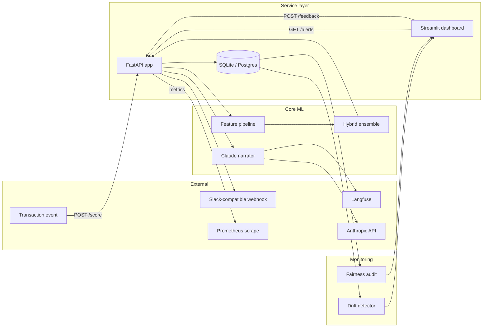

# Architecture

## Overview

The AML monitoring service is composed of five horizontal layers that map cleanly onto five Python packages under `src/`:

1. **Data layer** (`src.data`) — schema, temporal splits, typology catalog.
2. **Feature layer** (`src.features`) — entity, velocity, and graph features wrapped in a zero-leakage sklearn pipeline.
3. **Model layer** (`src.models`) — hybrid Isolation Forest + gradient-boosted classifier ensemble.
4. **Triage layer** (`src.triage`) — Claude-powered evidence-bound case narrator.
5. **Service layer** (`src.api`, `src.persistence`, `src.observability`, `src.monitoring`) — FastAPI surface, SQLite persistence, observability, drift / fairness monitors.

The Streamlit investigator UI in `ui/` is a thin HTTP client over the service layer. The notebooks in `notebooks/` exercise the same code paths in offline analysis.

## Component diagram

## Scoring path

The synchronous portion of the request. Designed for sub-150 ms p99 latency.

1. **Request validation.** FastAPI deserialises the request into `TransactionScoreRequest`. Unknown fields → HTTP 422.
2. **Feature engineering.** Single-row DataFrame goes through `build_engineered_frame`. Entity / velocity / graph features compute against the in-batch context.
3. **Ensemble scoring.** Feature matrix → `AnomalyScorer.score()` and `supervised_classifier.predict_proba()`. Combination via configured weights (0.35 anomaly, 0.65 supervised).
4. **Tier assignment.** Score → one of four tiers via `configs/alert_thresholds.yaml`.
5. **Alert persistence.** If score crosses the threshold and tier is not `suppressed`, persist an alert + emit audit-log event.
6. **Tier-aware triage policy.**
   - `tier_3_critical` → run Claude triage synchronously; dispatch webhook in background.
   - `tier_2_high` → schedule Claude triage as a background task; response returns immediately.
   - `tier_1_medium` → defer Claude triage until investigator pickup.
7. **Response.** Score breakdown, tier, alert_id (if created), top features, model version, inference latency.

## Triage path

Called either inline (tier 3) or as a background task. Always operates from the persisted `evidence_snapshot`.

1. Reconstruct an `EvidenceBundle` from the snapshot.
2. Render the active prompt template (`CASE_NARRATIVE_V1`).
3. Call Claude with `temperature=0` for deterministic output.
4. Parse JSON. Defensively strip code fences.
5. Validate against `NarratorResult` schema.
6. **Citation grounding** — verify every cited `feature_name` and `transaction_id` exists in the evidence bundle. Reject otherwise.
7. On validation or grounding failure, retry with a strengthening preamble naming the specific error (max 2 retries).
8. On retries exhausted, emit a `schema_failure` refusal — never a silent dropout.
9. Persist the result against the alert; emit audit-log event.
10. Emit Langfuse trace and Prometheus metrics (latency, tokens, estimated USD cost).

## Feedback path

Investigator dispositions captured via `POST /feedback` from the UI or any HTTP client.

1. Look up the alert. 404 if missing.
2. Enforce business rule: `sar_filed` disposition requires justification (HTTP 400 otherwise).
3. Persist feedback row.
4. Transition alert status: `cleared` → `CLEARED`, `escalated` → `ESCALATED`, `sar_filed` → `SAR_FILED`.
5. Emit audit-log event.
6. Increment `aml_feedback_total{disposition, tier}` metric.

## Data layer details

The schema constants in `src.data.loader` are the single source of truth. Renaming a column there propagates to:

- The sklearn `ColumnTransformer` in `src.features.pipelines`
- The API request schema in `src.api.schemas`
- The database column references in `src.persistence.models`
- The test fixtures in `tests/conftest.py`

A schema-name change in any other place will fail to compile because every reference points back to `loader.py`.

## Persistence model

Three tables, normalised, with explicit index policy:

- `alerts` — primary table. Composite index `(status, tier, created_at)` matches the investigator UI's queue query.
- `feedback` — append-only history of investigator dispositions per alert. The latest entry determines the canonical alert status.
- `audit_log` — append-only event stream. Indexed on `(alert_id, event_type, created_at)` for compliance queries.

Foreign-key behaviour: `alerts → feedback` is `CASCADE` on delete; `alerts → audit_log` is `SET NULL` so audit records survive alert deletion (compliance retention).

## Configuration surface

Three layers of configuration with deliberately different change cadences:

- **Code constants** (`Final` in `src.data.loader`) — change requires a code release.
- **Structural YAML** (`configs/*.yaml`) — change requires a deployment but not a code release. Search spaces, thresholds, cost matrix.
- **Environment variables** (`.env` / runtime) — change requires a process restart. Secrets, per-environment URLs, feature flags.

## Observability surface

Two telemetry channels, both best-effort with respect to the scoring path:

- **Langfuse** — every LLM call traced with prompt, response, tokens, latency, and alert ID. Searchable for quality review and cost analysis.
- **Prometheus** — 9 metrics scraped via the `/metrics` endpoint. Histograms for latency and score distribution; counters for alert volume, LLM tokens / cost, refusals, webhook outcomes, feedback distribution, drift events.

A Langfuse outage or Prometheus scrape failure cannot affect the scoring path — every producer is wrapped in `try/except` that logs at DEBUG and continues.

## Failure modes and degradation

| Failure | Behaviour |
|---|---|
| LLM provider unavailable | Triage emits structured refusal with `schema_failure` code. Alert flows to investigator without narrative. |
| Database unavailable | `/health` reports `database_healthy=False`. Score path raises; operator-actionable. |
| Webhook target unreachable | Dispatch retries 3× with exponential backoff capped at 8s. Final failure logs and increments `aml_webhook_deliveries_total{outcome="failed"}`. Scoring path unaffected. |
| Langfuse client init fails | Logged at WARN. Tracing disabled; scoring path unaffected. |
| Model artifact missing at startup | `/health` reports `model_loaded=False`. Score path raises; operator-actionable. |
| Validation retry budget exhausted | `schema_failure` refusal returned to investigator. Investigator reviews without LLM assistance. |
